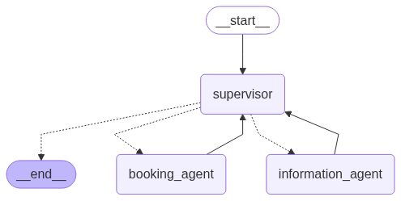

# 🤖 Appointment Booking Multi-Agent System

This project demonstrates an **AI-powered multi-agent system** for booking, rescheduling, and canceling appointments in a human-like conversational interface. It uses `LangGraph`, `LangChain`, and `React-style agents`, backed by SQLite-based stateful memory for conversation tracking and tool usage.

---

## 📌 Table of Contents

* [Overview](#overview)
* [Architecture](#architecture)
* [Key Agents](#key-agents)
* [Tech Stack](#tech-stack)
* [Installation](#installation)
* [Usage](#usage)
* [Folder Structure](#folder-structure)
* [License](#license)
* [Contact](#contact)

---

## 📖 Overview

This system supports:

* Intelligent **booking, rescheduling, and cancellation** of appointments
* Providing **doctor availability information** or handling **FAQ-style** queries
* **Memory-backed supervision and handoffs** between specialized agents
* Extensible via LangGraph with built-in SQLite checkpointing

---

## 🧠 Architecture

<p align="center">
  
</p>

* `User Message` ➝ `Supervisor Agent`
* `Supervisor` decides whether to route to:

  * `Booking Agent`: for booking, cancelling, rescheduling
  * `Information Agent`: for FAQs, doctor availability
* Each agent has tool access, and state is tracked using SQLite (`checkpoint.db`)

---

## 🧱 Key Agents

### 🗓️ Booking Agent

Handles:

* `set_appointment`
* `cancel_appointment`
* `reschedule_appointment`

### 📊 Information Agent

Handles:

* `check_availability`
* `check_availability_by_specialization`

### 🧑‍⚖️ Supervisor Agent

* Routes the query to the correct specialized agent
* Maintains history and handles handoffs
* Prompt provided via `prompt/system_prompt.py`

---

## 🛠️ Tech Stack

| Component      | Technology                           |
| -------------- | ------------------------------------ |
| Agents         | LangGraph + LangChain                |
| Language Model | OpenAI / LLM wrapper                 |
| State Saving   | SQLite (`checkpoint.db`)             |
| Tooling        | Custom Python tools                  |
| Prompting      | `ChatPromptTemplate`, `HumanMessage` |

---

## ⚙️ Installation

### Clone and Set Up

```bash
git clone https://github.com/rajkrishna92/Appointment-Booking-Multi-Agent.git
cd Appointment-Booking-Multi-Agent
python3 -m venv venv
source venv/bin/activate
pip install -r requirements.txt
```

### Environment Setup

Create a `.env` file if needed to configure LLM or tool endpoints.

---

## 🚀 Usage

Run the system:

```bash
python main.py
```

You’ll see a full conversation trace based on your initial message (e.g. `"what is my name?"`) and how agents respond using tools or handoffs.

---

## 📁 Folder Structure

```
Appointment-Booking-Multi-Agent/
├── agent.py
├── data
│   ├── availability.csv
│   └── checkpoint.db
├── main.py
├── prompt
│   ├── __init__.py
│   ├── prompt.py
├── README.md
├── requirements.txt
├── setup.py
├── toolkit
│   ├── __init__.py
│   └── tools.py
└── utils
    ├── data_model.py
    ├── helper.py
    ├── __init__.py
    └── llm.py
```

* **data/**: Contains records and other relevant data files.
* **prompt/**: Holds prompt templates for agent interactions.
* **toolkit/**: Includes tools and utilities for scheduling logic.
* **utils/**: Helper functions used across the project.
* **agent.py**: Defines the agent classes and their behaviors.
* **main.py**: Entry point of the application.

---

## 🤝 Contributing

Contributions are welcome! Please follow these steps:

1. **Fork the repository**

2. **Create a new branch**:

   ```bash
   git checkout -b feature/YourFeature
   ```

3. **Commit your changes**:

   ```bash
   git commit -m "Add YourFeature"
   ```

4. **Push to the branch**:

   ```bash
   git push origin feature/YourFeature
   ```

5. **Open a pull request**

---

## 📬 Contact

**Dr. Rajkrishna Mondal**
Data Scientist | Ph.D. in Computational Mathematics
[GitHub](https://github.com/rajkrishna92) | [Blog](https://www.rajkrishna92.github.io)
